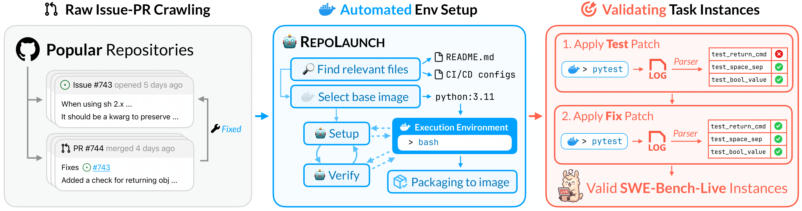

<p align="center">
  <a href="http://swe-bench-live.github.io">
    
  </a>
</p>

<p align="center">
  <em>A brand-new, continuously updated SWE-bench-like dataset powered by an automated curation pipeline.</em>
</p>

<p align="center">
  <a href="https://arxiv.org/abs/2505.23419">
        
  </a>
  <a href="./LICENSE">
        
  </a>
  <a href="https://swe-bench-live.github.io">
        
  </a>
  <a href="https://huggingface.co/collections/SWE-bench-Live/swe-bench-live">
        
  </a>
</p>

---

SWE-bench-Live is the **first automatically-updating, multi-language and multi-os** SWE task set designed for agentic benchmarking and training. This repository provides:
1. The **evaluation script** to evaluate the prediction patches of your agent on our public huggingface datasets: _SWE-bench-Live/SWE-bench-Live (Python)_, _SWE-bench-Live/MultiLang_ and _SWE-bench-Live/Windows_. 
2. The **task-creation source code** for you to create your customized SWE tasks for large-scale agentic RFT/RL, each paired with an executable docker sandbox.

## News
- **16/05/2026**: Updated more tasks for SWE-bench-Live/MultiLang (743 tasks on 6 languages from 381 repos in Linux container environment) and SWE-bench-Live/Windows (61 tasks on 6 languages from 44 repos in Windows container environment). 
- **08/03/2026**: SWE-bench-Live/Windows has been released along with the leaderboard, evaluating LLM's ability to resolve Windows-specific implementation and take actions in powershell. Newest paper updating all progress since the last NIPS paper is available at [RepoLaunch: Automating Build&Test Pipeline of Code Repositories on ANY Language and ANY Platform](https://arxiv.org/abs/2603.05026).
- **10/01/2026**: SWE-bench-Live/Multi-Language with the leaderboard has been released. Merged into main. Supported languages: C/C++, C#, Java, TS/JS, Go, Rust. For old source code SWE-bench-Live/SWE-bench-Live (Python-only, the NIPS paper version), refer to [python-only branch](https://github.com/microsoft/SWE-bench-Live/tree/python-only).
- **09/17/2025**: Dataset updated (through 08/2025)! We’ve finalized the update process for huggingface dataset SWE-bench-Live/SWE-bench-Live (Python tasks): **Each month, we will add 50 newly verified, high-quality issues to the dataset test split**. The `lite` and `verified` splits will remain frozen, ensuring fair leaderboard comparisons and keeping evaluation costs manageable. To access all the latest issues, please refer to the `full` split!


## 🚀 Set Up

```bash
# Python >= 3.10
pip install -e .
```

> [!NOTE]
> Though this eval script has ensured backward compatibility with SWE-bench-Live/SWE-bench-Live (Python-only, the NIPS paper version), which uses swebench library for evaluation, if you want to evaluate on SWE-bench-Live/SWE-bench-Live (Python), for fair comparison we still recommend you to go to our old [Python-only branch](https://github.com/microsoft/SWE-bench-Live/blob/python-only/README.md) and follow the old evaluation method. The below eval script is more suitable for our new datasets SWE-bench-Live/MultiLang and SWE-bench-Live/Windows.

Test your installation by running:
```bash
python -m evaluation.evaluation \
    --dataset SWE-bench-Live/MultiLang \
    --instance_ids rsyslog__rsyslog-6047 \
    --platform linux \
    --patch_dir gold \
    --output_dir logs/test \
    --workers 1 \
    --overwrite 1
```

## 🚥 Evaluation

Guide on running your model/agent on SWE-bench-Live: [evaluation/README.md](./evaluation/README.md)

## ⬆️ Submit your results

Thank you for your interest in submitting the success rate of your agent/model to SWE-bench-Live! We coordinate results submission via Pull Requests, see [SWE-bench-Live/submissions](https://github.com/swe-bench-live/submission) for instructions.

## 🐳 Development

If you would like to create your own SWE task instances with executable sandboxes, please follow [Development.md](./Development.md).

### Dataset Curation

In SWE-bench-Live, we propose an automated pipeline for curating SWE-bench-like dataset.

<p align="center">
  
  <br>
  <em>SWE-bench-Live Curation Pipeline</em>
</p>

### RepoLaunch

We addresses the bottleneck of setting up execution environments by automating the process through an LLM-based agentic tool – [RepoLaunch](https://github.com/microsoft/RepoLaunch). It can deliver a testable containerized environment for any given GitHub repository, thereby enabling test-based evaluation in SWE-bench-Live. 

### Collaboration

We welcome external collaborators to help us create more SWE tasks each month, and improve curation and launch source code. Please contact SWE-bench-Live@microsoft.com

Please feel free to raise issues and contribute pull requests to help us improve.


## 📚 Citation

If you refer to the SWE task creation pipeline of SWE-bench-Live, or SWE-bench-Live/SWE-bench-Live (Python only tasks), please cite

```bibtex

@article{zhang2025swebenchgoeslive,
  title={SWE-bench Goes Live!},
  author={Linghao Zhang and Shilin He and Chaoyun Zhang and Yu Kang and Bowen Li and Chengxing Xie and Junhao Wang and Maoquan Wang and Yufan Huang and Shengyu Fu and Elsie Nallipogu and Qingwei Lin and Yingnong Dang and Saravan Rajmohan and Dongmei Zhang},
  journal={arXiv preprint arXiv:2505.23419},
  year={2025}
}

```

If you refer to the automated build and test tool _RepoLaunch_, SWE benchmarking/training/RFT/RL environment build, SWE-bench-Live/Multi-Language or SWE-bench-Live/Windows, please cite

```bibtex
@article{li2026repolaunch,
  title={RepoLaunch: Automating Build\&Test Pipeline of Code Repositories on ANY Language and ANY Platform},
  author={Li, Kenan and Li, Rongzhi and Zhang, Linghao and Jin, Qirui and Zhu, Liao and Huang, Xiaosong and Zhang, Geng and Zhang, Yikai and He, Shilin and Xie, Chengxing and others},
  journal={arXiv preprint arXiv:2603.05026},
  year={2026}
}
```


## Contributing

This project welcomes contributions and suggestions.  Most contributions require you to agree to a
Contributor License Agreement (CLA) declaring that you have the right to, and actually do, grant us
the rights to use your contribution. For details, visit https://cla.opensource.microsoft.com.

When you submit a pull request, a CLA bot will automatically determine whether you need to provide
a CLA and decorate the PR appropriately (e.g., status check, comment). Simply follow the instructions
provided by the bot. You will only need to do this once across all repos using our CLA.

This project has adopted the [Microsoft Open Source Code of Conduct](https://opensource.microsoft.com/codeofconduct/).
For more information see the [Code of Conduct FAQ](https://opensource.microsoft.com/codeofconduct/faq/) or
contact [opencode@microsoft.com](mailto:opencode@microsoft.com) with any additional questions or comments.

## Trademarks

This project may contain trademarks or logos for projects, products, or services. Authorized use of Microsoft 
trademarks or logos is subject to and must follow 
[Microsoft's Trademark & Brand Guidelines](https://www.microsoft.com/en-us/legal/intellectualproperty/trademarks/usage/general).
Use of Microsoft trademarks or logos in modified versions of this project must not cause confusion or imply Microsoft sponsorship.
Any use of third-party trademarks or logos are subject to those third-party's policies.
